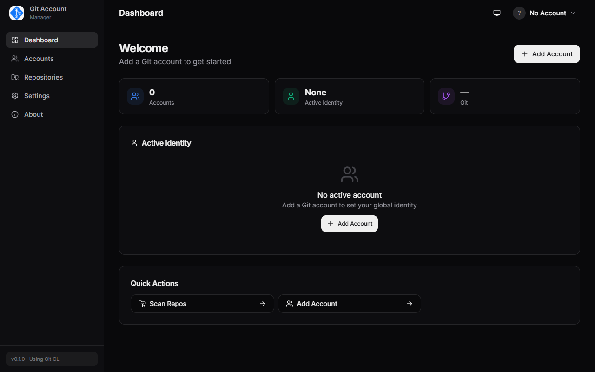
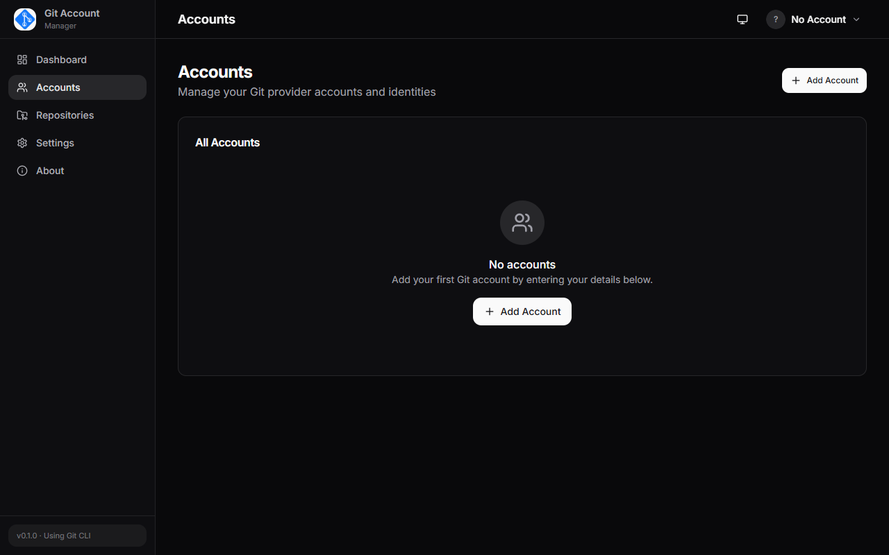
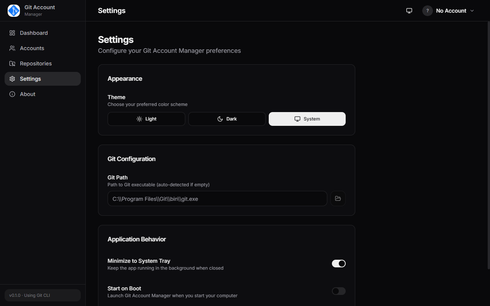

# Git Account Manager

> **A cross-platform desktop app to manage multiple Git identities and accounts.**

Switch between Git accounts, manage credentials, and keep your Git workflows organized — all from one beautiful desktop app built with Rust + Tauri.


---

## 🖼️ Preview

| Dashboard | Accounts | Settings |
|-----------|----------|----------|
|  |  |  |

---

## ✨ Features

- **🔐 Account Management** — Add GitHub, GitLab, Bitbucket, or custom Git accounts with personal access tokens. Tokens are stored securely in your OS credential manager.
- **🔄 Quick Identity Switch** — Switch your global Git identity from the top bar or Accounts page. Sets `git config --global user.name` and `user.email` instantly.
- **📁 Repository Tracking** — Add local Git repositories via the native folder picker. See branch, uncommitted changes, and ahead/behind status at a glance.
- **🗑️ Delete with Options** — Remove repos from the app list, delete local folders, or even delete on GitHub/GitLab — all from one dialog.
- **🌗 Beautiful UI** — Dark / Light / System themes with a clean, modern design.
- **⚡ Fast & Lightweight** — Built with Rust + Tauri for minimal memory and CPU usage.
- **🛡️ OS-Native Security** — Secrets stored in Windows Credential Manager, macOS Keychain, or Linux Secret Service. Never stored in plaintext.

## 🖥️ Tech Stack

| Layer | Technology |
|-------|-----------|
| **Frontend** | React 19, TypeScript, Vite, TailwindCSS, shadcn/ui |
| **Backend** | Rust, Tauri 2.0 |
| **Database** | SQLite (via rusqlite) |
| **Secrets** | OS-native keyring (keyring crate) |
| **State** | Zustand |
| **Routing** | React Router v7 |
| **Icons** | Lucide |

## 📋 Prerequisites

| Tool | Version | Install |
|------|---------|---------|
| **Rust** | 1.77+ | [rustup.rs](https://rustup.rs) |
| **Node.js** | 18+ | [nodejs.org](https://nodejs.org) |
| **pnpm** | 8+ | `npm install -g pnpm` |
| **Git** | 2.x+ | [git-scm.com](https://git-scm.com) |

### Platform-specific requirements

**Windows 10/11:**
- WebView2 is built-in. No additional install needed.
- OpenSSH Client (optional, for SSH key features):  
  *Settings → Apps → Optional Features → Add a feature → OpenSSH Client*

**Linux (Ubuntu/Debian):**
```bash
sudo apt install libwebkit2gtk-4.1-dev libgtk-3-dev libayatana-appindicator3-dev librsvg2-dev
```

**macOS:**
- Xcode Command Line Tools: `xcode-select --install`

## 🚀 Getting Started

```bash
# 1. Clone the repository
git clone https://github.com/ridhotegar/Git-Account-Manager.git
cd Git-Account-Manager

# 2. Install frontend dependencies
pnpm install

# 3. Run in development mode (hot reload)
pnpm tauri:dev

# 4. Build for production
pnpm tauri:build
```

The built packages will be in `src-tauri/target/release/bundle/`.

## 📦 Download

Pre-built binaries are available on the [Releases page](https://github.com/ridhotegar/Git-Account-Manager/releases).

| Platform | Format | When to use |
|----------|--------|-------------|
| **Windows** | `.msi` | Standard installer — recommended |
| **Windows** | `.exe` (portable) | Run from USB, no install needed |
| **Linux** | `.AppImage` | Run on any distro, no install needed |
| **macOS** | `.dmg` | Standard macOS app |

## 🏗️ Build from Source

### Build all platforms (current OS only)
```bash
pnpm tauri:build
```

### Platform-specific builds
```bash
pnpm tauri:build:win         # Windows MSI installer
pnpm tauri:build:portable    # Windows portable .exe (no installer)
pnpm tauri:build:linux       # Linux AppImage
pnpm tauri:build:mac         # macOS DMG
```

> **Note:** Cross-compilation requires the appropriate toolchain for each target.
> The easiest way to build for all platforms is to use GitHub Actions CI.

## 📁 Project Structure

```
git-account-manager/
├── src/                        # Frontend (React + TypeScript)
│   ├── components/
│   │   ├── ui/                # shadcn/ui components
│   │   └── layout/            # Sidebar, TopBar, AppLayout
│   ├── pages/                  # Route pages
│   │   ├── Dashboard.tsx
│   │   ├── Accounts.tsx
│   │   ├── Repositories.tsx
│   │   ├── Settings.tsx
│   │   └── About.tsx
│   ├── stores/                 # Zustand state
│   ├── lib/                    # Tauri API wrapper + utilities
│   ├── types/                  # TypeScript definitions
├── src-tauri/                  # Backend (Rust)
│   ├── src/
│   │   ├── commands/           # Tauri command handlers
│   │   ├── accounts/           # Account service
│   │   ├── git/                # Git CLI integration
│   │   ├── repository/         # Repository management
│   │   ├── credential/         # OS keyring integration
│   │   ├── oauth/              # GitHub token verification
│   │   ├── database/           # SQLite + migrations
│   │   ├── settings/           # App settings
│   │   ├── models/             # Data models
│   │   ├── services/           # AppState & DI
│   │   └── errors/             # Error types
│   ├── Cargo.toml
│   └── tauri.conf.json
├── .gitignore
├── package.json
└── README.md
```
## 🤝 How to Use

### Adding a GitHub Account
1. Create a **Personal Access Token** at [github.com/settings/tokens](https://github.com/settings/tokens) with `repo` and `user` scopes
2. Open the app → **Accounts** page → **Add Account**
3. Select **GitHub**, paste your token, click **Verify & Connect**
4. Your name, username, and email are auto-detected from the API

### Switching Accounts
- Click the account avatar in the **top-right corner** → select any account
- Or go to **Accounts** page → click **Set Active** on any account
- This updates `git config --global user.name` and `user.email` automatically

### Tracking Repositories
1. Go to **Repositories** page → **Add Folder**
2. Browse and select any Git repository folder
3. See the branch, changes status, and assign an account

## 🛡️ Security

- Tokens are **never** stored in the SQLite database — only a reference key is saved
- Actual secrets live in your **OS credential manager** (Windows Credential Manager, macOS Keychain, Linux Secret Service)
- The app never sends data to any external server except the Git provider APIs you explicitly authorize

## 📄 License

MIT License — see the [LICENSE](LICENSE) file.

## 🙏 Acknowledgments

- Built with [Tauri](https://tauri.app)
- UI components from [shadcn/ui](https://ui.shadcn.com)
- Icons from [Lucide](https://lucide.dev)
